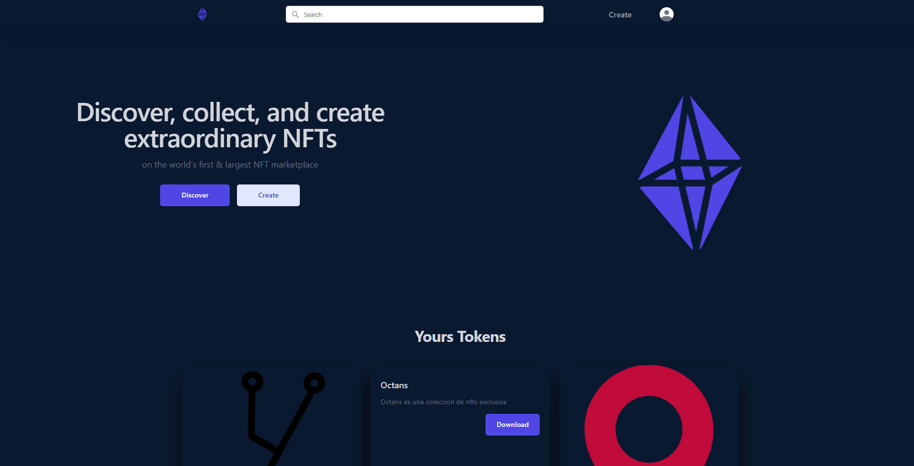

# OctansNFTs

Octans es una plataforma web de NFTs (Tokens No Fungibles) construida con React y Ethereum. Proporciona una experiencia fluida para que los usuarios puedan crear NFTs interactuando con la blockchain a través de su wallet conectada.

## Características
* Conectar Wallet: Octans permite a los usuarios conectar su wallet de Ethereum, como MetaMask, a la plataforma. Esta conexión habilita interacciones seguras con la blockchain y la creación de NFTs.
* Crear NFTs: Una vez conectados, los usuarios pueden crear fácilmente sus propios NFTs. Pueden cargar imágenes, definir metadatos y establecer detalles únicos para cada NFT, como título, descripción y características adicionales.
* Interactuar con la Blockchain: Octans brinda a los usuarios la capacidad de interactuar directamente con la blockchain de Ethereum. Pueden firmar transacciones y desplegar sus NFTs en la red, lo que les otorga la propiedad y autenticidad de los activos digitales.
* Gestión de NFTs: Octans proporciona una interfaz intuitiva para que los usuarios administren sus NFTs. Pueden ver una lista de sus NFTs creados, editar metadatos, transferir la propiedad a otros usuarios y realizar otras acciones relacionadas con la gestión de sus activos digitales.

## Contribución
¡Agradecemos y valoramos las contribuciones de la comunidad para mejorar Octans! Si tienes alguna idea, sugerencia o encuentras algún problema, no dudes en crear un problema en el repositorio o enviar un pull request. Estamos emocionados de recibir la participación de otros desarrolladores.

## Contacto
Si tienes alguna pregunta o sugerencia sobre Octans, por favor, no dudes en ponerte en contacto enviando un correo electrónico a yagoigle@gmail.com.

¡Gracias por utilizar Octans y ser parte del emocionante mundo de los NFTs!
